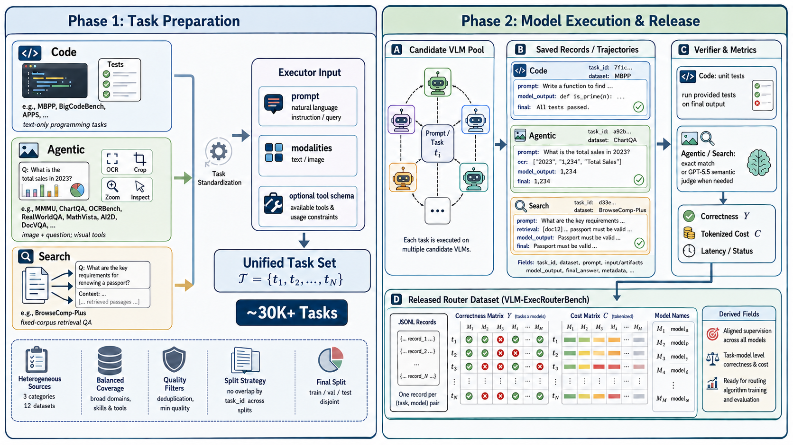
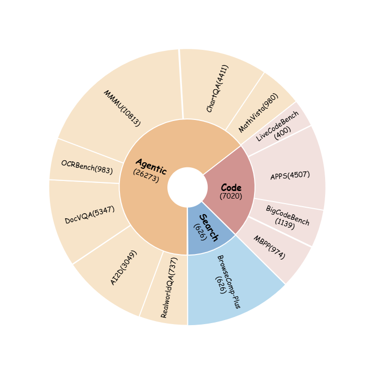

# VLM-ExecRouterBench

VLM-ExecRouterBench is the execution-oriented benchmark pipeline used by
SCOPE-Router. It converts heterogeneous source tasks into executable router
tasks, runs candidate VLMs through shared executors, verifies the resulting
answers or trajectories, and writes correctness/cost records that can be turned
into router training matrices.

The benchmark is designed for routing rather than single-model evaluation. Each
sample is executed by a pool of candidate VLMs, and each execution contributes
both a correctness label and an inference cost. This makes it possible to study
accuracy-cost tradeoffs, oracle upper bounds, and open-set onboarding of new
models through calibration profiles.

## Released Data

The released benchmark artifacts are hosted on Hugging Face:

```text
https://huggingface.co/datasets/Kirito-Lab/VLM-ExecRouterBench
```

For router training and evaluation, download the prepared artifacts from the
root SCOPE-Router README and use them as the `--dataset_dir`. The code in this
subdirectory is mainly for reproducing or extending the benchmark construction
pipeline: preparing source tasks, executing candidate VLMs, verifying outputs,
and packaging the resulting matrices.

## Data Generation Overview



The pipeline starts from heterogeneous source benchmarks and normalizes them
into executable task records. Candidate models then run through a shared
executor interface, and task-specific verifiers convert the resulting outputs,
tool traces, or code patches into correctness/cost rows.

## Dataset Composition

<p align="center">
  
</p>

VLM-ExecRouterBench covers three broad execution-oriented categories:

| Category | Examples | What The Router Sees |
|---|---|---|
| Agentic | ChartQA, MathVista, MMMU, OCRBench, DocVQA, AI2D, RealWorldQA | Multimodal instructions and images/documents requiring visual reasoning, OCR, chart reading, or grounded QA. |
| Code | MBPP, APPS, BigCodeBench, LiveCodeBench | Programming prompts that are verified by tests or benchmark-specific evaluators. |
| Search | BrowseComp-Plus | Search-style questions where tool-assisted retrieval and answer verification matter. |

The mix intentionally contains tasks where the best model changes by domain,
modality, and cost regime. This is the setting where a router can improve over
always using the cheapest or strongest model.

## What This Pipeline Produces

The benchmark-side pipeline produces execution records such as:

```text
task source -> executor input -> candidate VLM output -> verifier result
```

Those records are then converted into downstream router artifacts:

```text
correctness matrix Y
cost matrix C
sample/model metadata
router SFT examples
```

The router-side SCOPE-Router code in the parent repository consumes these
matrices and metadata for calibration selection, profile construction, training,
and evaluation.

## Contents

| Path | Purpose |
|---|---|
| `scripts/build_openclaw_tasks.py` | Build executable tasks from source datasets. |
| `scripts/generate_router_sft.py` | Run candidate models, verify outputs, and generate result/SFT files. |
| `scripts/openclaw_gateway_call.mjs` | Helper for OpenClaw Gateway multimodal calls. |
| `scripts/run_mini_agent_executor.py` | Lightweight text/multimodal executor wrapper. |
| `scripts/run_openclaw_executor.py` | OpenClaw-backed text/tool executor wrapper. |
| `scripts/run_openclaw_vision_executor.py` | OpenClaw-backed multimodal executor wrapper. |
| `scripts/run_swebench_*executor.py` | SWE-bench execution wrappers. |
| `scripts/run_bigcodebench_eval.py` | BigCodeBench verifier wrapper. |
| `scripts/run_livecodebench_eval.py` | LiveCodeBench verifier wrapper. |
| `scripts/ocr_server.py` | PaddleOCR HTTP service used by multimodal tasks. |
| `scripts/browsecomp_plus_retriever.py` | BrowseComp-Plus retrieval service. |
| `scripts/estimate_openrouter_cost.py` | Estimate model-call costs from result logs. |
| `scripts/select_executor_tasks.py` | Select task subsets for execution. |
| `scripts/prepare_sft_sources.py` | Package generated records for router SFT-style training. |
| `scripts/setup_router_sft_conda_envs.sh` | Helper for auxiliary conda environments. |
| `scripts/start_router_sft_services.sh` | Start/stop OCR and retrieval services. |
| `scripts/run_router_sft_full_shards.sh` | Multi-shard generation launcher. |
| `configs/router_sft_env.example.sh` | Environment-variable template. |
| `prompts/router_sft/` | Executor and tool-use prompt templates. |
| `docs/` | Longer operational runbooks. |

## Setup

Copy the environment template and fill in local paths and API keys:

```bash
cp configs/router_sft_env.example.sh configs/router_sft_env.local.sh
chmod 600 configs/router_sft_env.local.sh
source configs/router_sft_env.local.sh
```

Install auxiliary environments when running the full execution pipeline:

```bash
bash scripts/setup_router_sft_conda_envs.sh all
```

For selected components:

```bash
bash scripts/setup_router_sft_conda_envs.sh code ocr browsecomp swebench swe-agent
```

See `docs/setup_router_sft_conda_envs.md` for detailed dependency notes.

## Execution Backends

`scripts/generate_router_sft.py` supports multiple execution backends through
`--executor-backend`:

| Backend | Typical Use | How It Executes |
|---|---|---|
| `raw_api` | Direct API evaluation and BrowseComp-Plus tool-loop runs. | Calls chat-completion-compatible providers directly from `generate_router_sft.py`; BrowseComp-Plus uses the local retriever tool loop when needed. |
| `mini_agent` | Lightweight multimodal/document VQA tasks and SWE-bench runs without OpenClaw. | Uses `--mini-agent-command` for normal tasks, defaulting to `scripts/run_mini_agent_executor.py`. For SWE-bench real-repo patch tasks it uses `--swebench-mini-agent-command`, defaulting to `scripts/run_swebench_mini_agent_executor.py`, which delegates to the mini-swe-agent wrapper. |
| `openclaw` | OpenClaw-backed text, tool, multimodal, and SWE-bench execution. | Uses `--openclaw-command` for normal tasks, defaulting to `scripts/run_openclaw_executor.py`. For SWE-bench real-repo patch tasks it uses `--swebench-openclaw-command`, defaulting to `scripts/run_swebench_openclaw_executor.py`. |

The backend commands are templates. They receive placeholders such as
`{input}`, `{output}`, `{model}`, `{provider}`, `{task_id}`, `{category}`,
`{timeout}`, `{temperature}`, `{max_tokens}`, and `{executor_model_ref}`.

You can override them either through CLI flags:

```bash
python scripts/generate_router_sft.py \
  --executor-backend openclaw \
  --openclaw-command 'python3 scripts/run_openclaw_executor.py --input {input} --output {output}' \
  ...
```

or through environment variables:

```bash
export MINI_AGENT_EXECUTOR_COMMAND='python3 scripts/run_mini_agent_executor.py --input {input} --output {output} --model {executor_model_ref} --temperature {temperature} --max-tokens {max_tokens} --timeout {timeout}'
export SWEBENCH_MINI_AGENT_COMMAND='conda run -n swe-agent python scripts/run_swebench_mini_agent_executor.py --input {input} --output {output} --model {executor_model_ref} --model-ref {executor_model_ref}'
export OPENCLAW_EXECUTOR_COMMAND='python3 scripts/run_openclaw_executor.py --input {input} --output {output}'
export SWEBENCH_OPENCLAW_EXECUTOR_COMMAND='python3 scripts/run_swebench_openclaw_executor.py --input {input} --output {output}'
```

For model-reference mismatches between candidate names and executor/provider
names, pass `--openclaw-model-ref-map` as a JSON object or path. Despite the
legacy option name, this map is also used by command-based executor backends:

```bash
python scripts/generate_router_sft.py \
  --executor-backend mini_agent \
  --openclaw-model-ref-map '{"qwen/qwen3-vl-8b-instruct":"openrouter/qwen/qwen3-vl-8b-instruct"}' \
  ...
```

## Services

Some tasks use local OCR and retrieval services. Start them with:

```bash
bash scripts/start_router_sft_services.sh start
```

Useful service commands:

```bash
bash scripts/start_router_sft_services.sh status
bash scripts/start_router_sft_services.sh check
bash scripts/start_router_sft_services.sh restart
bash scripts/start_router_sft_services.sh stop
```

The default layout starts BrowseComp-Plus retrievers on ports `8765-8768` and
PaddleOCR servers on ports `8775-8778`. Override the port/GPU layout through the
environment variables documented in `docs/router_sft_runbook.md`.

## Run Generation

After preparing source tasks and starting any required services, launch a
multi-shard generation run:

```bash
nohup bash scripts/run_router_sft_full_shards.sh \
  > logs/router_sft_full_shards.log 2>&1 &
echo $! > logs/router_sft_full_shards.pid
```

Monitor the run:

```bash
tail -f logs/router_sft_full_shards.log
```

For a smaller smoke run or a single task file, call
`scripts/generate_router_sft.py` directly. Example:

```bash
python scripts/generate_router_sft.py \
  --tasks path/to/tasks.jsonl \
  --results-out runs/example_results.jsonl \
  --sft-out runs/example_sft.jsonl \
  --summary-out runs/example_summary.json \
  --category multimodal_doc_visual \
  --executor-backend mini_agent \
  --candidate-model openrouter/qwen/qwen3-vl-8b-instruct \
  --run-all \
  --budget-policy full \
  --max-workers 1 \
  --timeout 300 \
  --skip-errors
```

To run the same task file through OpenClaw instead, switch the backend:

```bash
python scripts/generate_router_sft.py \
  --tasks path/to/tasks.jsonl \
  --results-out runs/openclaw_results.jsonl \
  --sft-out runs/openclaw_sft.jsonl \
  --summary-out runs/openclaw_summary.json \
  --category tool_workflow \
  --executor-backend openclaw \
  --candidate-model openrouter/qwen/qwen3-vl-8b-instruct \
  --run-all \
  --budget-policy full \
  --max-workers 1 \
  --timeout 300 \
  --skip-errors
```

For SWE-bench tasks, choose the backend according to the executor you want:

```bash
# mini-swe-agent path
python scripts/generate_router_sft.py \
  --tasks path/to/swebench_tasks.jsonl \
  --results-out runs/swebench_mini_agent_results.jsonl \
  --sft-out runs/swebench_mini_agent_sft.jsonl \
  --summary-out runs/swebench_mini_agent_summary.json \
  --category code_debug_edit \
  --executor-backend mini_agent \
  --candidate-model openrouter/qwen/qwen3-vl-8b-instruct \
  --run-all \
  --budget-policy full \
  --timeout 300 \
  --skip-errors

# OpenClaw path
python scripts/generate_router_sft.py \
  --tasks path/to/swebench_tasks.jsonl \
  --results-out runs/swebench_openclaw_results.jsonl \
  --sft-out runs/swebench_openclaw_sft.jsonl \
  --summary-out runs/swebench_openclaw_summary.json \
  --category code_debug_edit \
  --executor-backend openclaw \
  --candidate-model openrouter/qwen/qwen3-vl-8b-instruct \
  --run-all \
  --budget-policy full \
  --timeout 300 \
  --skip-errors
```

## From Execution Logs to Router Data

Generated result files contain per-task model outputs, verifier decisions, and
cost information. Use the parent repository tools to build router matrices and
metadata from those records:

```bash
python ../tools/build_matrices.py --help
python ../tools/build_cost_matrix_from_tokens.py --help
```

Once `Y`, `C`, sample ids, model names, and metadata are prepared, the parent
SCOPE-Router workflow can select calibration samples, build profiles, and train
the router.

## Runbooks

More detailed operational instructions are available here:

- `docs/router_sft_runbook.md`
- `docs/setup_router_sft_conda_envs.md`

## Notes

- Keep real API keys out of version control.
- Keep generated datasets, model outputs, trajectories, indexes, and caches out
  of this repository.
- API providers and model catalogs can change; update
  `configs/router_sft_env.local.sh` when provider model ids or endpoints change.
