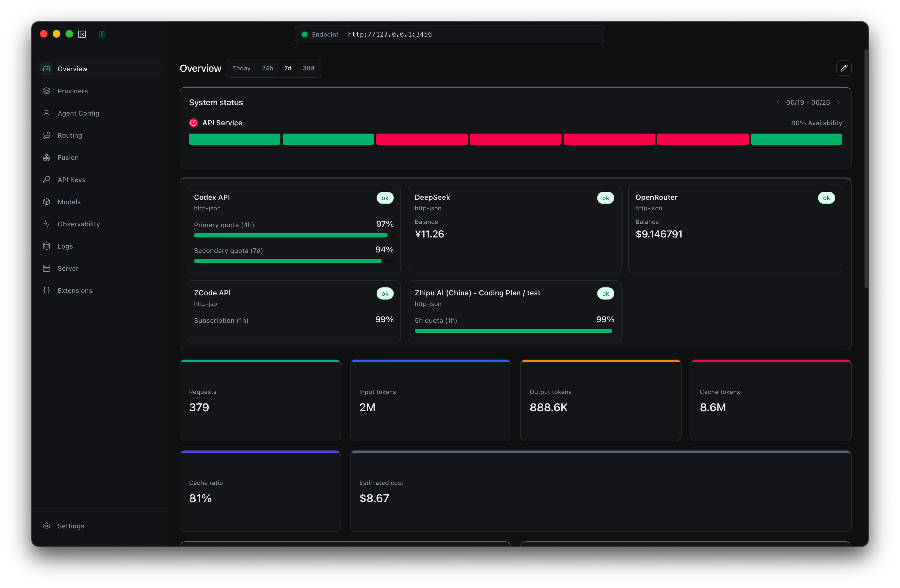

<h1 align="center">Claude Code Router Desktop</h1>

<p align="center">
  <a href="README_zh.md"></a>
  <a href="https://discord.gg/rdftVMaUcS"></a>
  <a href="https://github.com/musistudio/claude-code-router/blob/main/LICENSE"></a>
  <a href="https://ccrdesk.top/"></a>
</p>

<p align="center">
  
</p>

Claude Code Router Desktop is a local gateway and desktop control panel for routing agent requests from Claude Code, Codex, ZCode, and compatible clients to the model provider you actually want to use.

CCR runs on your machine, keeps provider configuration in your local config directory, and exposes a local gateway at `http://127.0.0.1:3456`.

## SCOPE-Router Smart Routing

This fork enables gateway-level SCOPE-Router by default. Before a request is
sent to the selected backend model, CCR calls a local SCOPE-Router service to
choose one configured `provider/model` candidate for the current agent request.
If SCOPE-Router is disabled, times out, or returns a non-candidate selector,
CCR falls back to the existing ACRouter/static routing path.

Start the SCOPE-Router service from the SCOPE-Router repository root:

```bash
python integrations/scope_router_service.py \
  --router /path/to/scope_router.pkl \
  --host 127.0.0.1 \
  --port 8760
```

Default `config.json` setting:

```json
{
  "ScopeRouter": {
    "enabled": true,
    "endpoint": "http://127.0.0.1:8760/route",
    "timeoutMs": 2000
  }
}
```

SCOPE-Router runs before ACRouter. The returned selector is written to
`body.model`, after which CCR continues its normal provider resolution,
forwarding, request logging, and fallback behavior.

Set `"enabled": false` to disable SCOPE-Router and use the original
ACRouter/static routing behavior. Increase `timeoutMs` if your router service
runs on a remote machine or cold-starts encoders on the first request.

## Why Use CCR

- Use one local endpoint for multiple agent tools instead of configuring every client separately.
- Route different workloads to different models, such as fast background work, reasoning tasks, long-context requests, image tasks, or web-search-capable models.
- Mix providers without changing your workflow. CCR supports OpenAI-compatible APIs, Anthropic Messages, Gemini Generate Content, OpenRouter, DeepSeek, SiliconFlow, Moonshot, Mistral, Z.AI, Bailian, and custom providers.
- Control cost and reliability with fallback routing, API key rotation, usage statistics, and request logs.
- Manage everything from a desktop UI instead of editing JSON by hand.
- Extend the gateway with plugins, proxy routes, local HTTP backends, and provider deeplinks.

## Features

- **Desktop dashboard**: start or stop the local gateway, inspect usage, configure the tray window, and manage runtime settings.
- **Provider management**: add provider presets or custom endpoints, test connectivity, manage credentials, and monitor supported account balances where available.
- **Routing rules**: set default, background, thinking, long-context, image, web-search, subagent, model-prefix, and conditional routing rules.
- **Agent profiles**: configure Claude Code, Codex, and ZCode profiles that point to the CCR gateway.
- **Gateway compatibility**: translate client requests through the local CCR wrapper and the core gateway runtime.
- **Proxy mode**: capture supported API traffic through a local proxy with optional system proxy integration and network capture.
- **Plugins**: install or load wrapper plugins, including routes for Claude Design and Cursor Proxy style integrations.
- **Virtual models**: expose aliases or composed model profiles for clients that expect a specific model name.
- **Provider deeplinks**: import provider configuration through `ccr://provider?...` links after user confirmation.

## Download And Install

1. Open the [GitHub Releases page](https://github.com/musistudio/claude-code-router/releases).
2. Download the package for your platform:
   - macOS: `Claude Code Router_<version>.dmg` or `.zip`
   - Windows: `Claude Code Router_<version>.exe`
   - Linux: `Claude Code Router_<version>.AppImage`
3. Install and launch **Claude Code Router**.
4. On first launch, CCR creates its local configuration:
   - macOS/Linux: `~/.claude-code-router/config.json`
   - Windows: `%APPDATA%\Claude Code Router\config.json`

CCR starts two local services when the gateway is enabled:

- CCR wrapper gateway: `http://127.0.0.1:3456`
- Core gateway runtime: `http://127.0.0.1:3457`

## Quick Start

CCR can be configured entirely from the desktop UI. Use this setup order for a clean first run.

### 1. Add a provider

Open **Providers**, click **Add Provider**, then choose a built-in preset or create a custom provider. Fill in the provider name, endpoint, protocol, API key, and model list in the form. Use the connectivity check when available, then save the provider.

### 2. Configure routing

Open **Routing** and select which provider/model should handle the default route. Then fill optional routes for background work, thinking requests, long-context requests, image tasks, and web search if you want different models for those scenarios.

Use **Add Routing Rule** when you need more control, such as model-prefix routing, subagent routing, request conditions, or fallback behavior.

This fork uses **SCOPE-Router** smart routing by default. SCOPE-Router runs
before ACRouter and writes the selected `provider/model` selector to
`body.model`.

CCR also includes **ACRouter** smart routing. It is enabled by default and asks a cheap router model to choose one configured `provider/model` candidate for each coding-agent request. If no router model is configured, CCR uses the cheapest callable model it can infer from your providers and pricing data. Static routing rules still provide the fallback target.

Optional `config.json` override:

```json
{
  "ACRouter": {
    "enabled": true,
    "routerProvider": "OpenAI",
    "routerModel": "gpt-4o-mini",
    "timeoutMs": 8000
  }
}
```

Set `"enabled": false` to return to static CCR routing only.

### 3. Start the gateway

Open **Server** and click **Start**. Enable auto start if you want CCR to start the local gateway whenever the desktop app opens.

### 4. Connect your agent tool

Open **Profiles** and choose the client you want to use. Configure the Claude Code, Codex, or ZCode profile from the form, select the target model, and apply the profile. For app-based profiles, use the profile action button to open the target app through CCR.

### 5. Monitor and adjust

Use **Dashboard** for usage and provider health, the tray window for quick token and account status, **Network Logs** for debugging provider behavior, and **Extensions** for plugin configuration.

## Provider Deeplink

Provider websites can open CCR and import a model provider with a custom protocol link:

```text
ccr://provider?name=Example%20AI&base_url=https%3A%2F%2Fapi.example.com%2Fv1&api_key=sk-example&models=example-chat%2Cexample-coder&protocol=openai_chat_completions
```

Supported query parameters:

- `name`: display name for the provider.
- `base_url`: provider API base URL.
- `api_key`: optional provider API key.
- `models`: comma-separated or newline-separated model list. You can also repeat `models=...`.
- `protocol`: one of `openai_chat_completions`, `openai_responses`, `anthropic_messages`, or `gemini_generate_content`.

For larger payloads, pass `payload` as URL-encoded JSON or base64url JSON with the same fields. CCR always opens a confirmation dialog before writing a provider imported from an external link.

## Plugins

CCR has two plugin layers:

- Core gateway plugins: use `providerPlugins` and `virtualModelProfiles`; these are passed through to the core gateway.
- Wrapper plugins: use top-level `plugins` to extend the Electron wrapper, register local HTTP backends, add gateway routes, and route proxy-mode traffic to plugin backends.

Example wrapper plugin route:

```json
{
  "plugins": [
    {
      "id": "local-admin-api",
      "enabled": true,
      "proxy": {
        "routes": [
          {
            "id": "admin-api",
            "host": "api.example.com",
            "paths": ["/v1/admin"],
            "upstream": "http://127.0.0.1:4510",
            "stripPathPrefix": false
          }
        ]
      }
    }
  ]
}
```

Plugin modules export a function or object with `setup(ctx)`. The context supports:

- `ctx.registerGatewayRoute({ method, path, auth, handler })`
- `ctx.registerHttpBackend({ id, host, port, handler })`
- `ctx.registerProxyRoute({ host, paths, upstream, stripPathPrefix, rewritePathPrefix, headers })`
- `ctx.openSqliteStore({ filename, migrate })`
- `ctx.registerCoreGatewayProviderPlugin(plugin)`
- `ctx.registerCoreGatewayVirtualModelProfile(profile)`

Local plugin examples are available in [examples/plugins](examples/plugins).

## Development

```bash
npm install
npm run dev
npm run typecheck
npm run build:assets
npm run build:app:mac
npm run build:app:win
```

`npm run build:assets` compiles the Electron main process and renderer assets into `dist/`.

`npm run build` packages the app for the current platform and writes installer artifacts to `release/`.

`npm run build:app:mac` and `npm run build:app:win` package platform-specific app artifacts. Linux AppImage packaging is configured in `electron-builder.json`.

`npm run build:app:mac` creates a local macOS test package in `release-local/` using ad-hoc signing. It is useful with a free Apple Account or Apple Development certificate, but it is not suitable for public distribution because downloaded copies will not pass Gatekeeper notarization checks.

macOS release builds are signed and notarized for distribution. Before running `npm run build:app:mac:release`, the build machine must have a `Developer ID Application` certificate available through the keychain or `CSC_LINK`/`CSC_KEY_PASSWORD`, full Xcode selected with `xcode-select`, and one notarization credential set:

- `APPLE_API_KEY`, `APPLE_API_KEY_ID`, and `APPLE_API_ISSUER`
- `APPLE_ID`, `APPLE_APP_SPECIFIC_PASSWORD`, and `APPLE_TEAM_ID`
- `APPLE_KEYCHAIN_PROFILE`, optionally with `APPLE_KEYCHAIN`

The macOS packaging hook validates codesigning, the stapled notarization ticket, and Gatekeeper assessment before writing distributable artifacts.

Packaged builds check GitHub Releases for updates through `electron-updater`. For local update feed testing, set `CCR_UPDATE_FEED_URL` to a generic electron-updater feed URL before starting the app. `CCR_UPDATE_ALLOW_PRERELEASE=1` enables prerelease updates.

## Further Reading

- [Project Motivation and How It Works](blog/en/project-motivation-and-how-it-works.md)
- [Maybe We Can Do More with the Router](blog/en/maybe-we-can-do-more-with-the-route.md)

## Acknowledgements

Codex support and Bot handoff are powered by [musistudio/codexl](https://github.com/musistudio/codexl).

## Support & Sponsoring

If you find this project helpful, please consider sponsoring its development. Your support is greatly appreciated.

[](https://ko-fi.com/F1F31GN2GM)

[Paypal](https://paypal.me/musistudio1999)

<table>
  <tr>
    <td></td>
    <td></td>
  </tr>
</table>

### Our Sponsors

A huge thank you to all our sponsors for their generous support.

- [AIHubmix](https://aihubmix.com/)
- [BurnCloud](https://ai.burncloud.com)
- @Simon Leischnig
- [@duanshuaimin](https://github.com/duanshuaimin)
- [@vrgitadmin](https://github.com/vrgitadmin)
- @\*o
- [@ceilwoo](https://github.com/ceilwoo)
- @\*说
- @\*更
- @K\*g
- @R\*R
- [@bobleer](https://github.com/bobleer)
- @\*苗
- @\*划
- [@Clarence-pan](https://github.com/Clarence-pan)
- [@carter003](https://github.com/carter003)
- @S\*r
- @\*晖
- @\*敏
- @Z\*z
- @\*然
- [@cluic](https://github.com/cluic)
- @\*苗
- [@PromptExpert](https://github.com/PromptExpert)
- @\*应
- [@yusnake](https://github.com/yusnake)
- @\*飞
- @董\*
- @\*汀
- @\*涯
- @\*:-）
- @\*\*磊
- @\*琢
- @\*成
- @Z\*o
- @\*琨
- [@congzhangzh](https://github.com/congzhangzh)
- @\*\_
- @Z\*m
- @\*鑫
- @c\*y
- @\*昕
- [@witsice](https://github.com/witsice)
- @b\*g
- @\*亿
- @\*辉
- @JACK
- @\*光
- @W\*l
- [@kesku](https://github.com/kesku)
- [@biguncle](https://github.com/biguncle)
- @二吉吉
- @a\*g
- @\*林
- @\*咸
- @\*明
- @S\*y
- @f\*o
- @\*智
- @F\*t
- @r\*c
- [@qierkang](http://github.com/qierkang)
- @\*军
- [@snrise-z](http://github.com/snrise-z)
- @\*王
- [@greatheart1000](http://github.com/greatheart1000)
- @\*王
- @zcutlip
- [@Peng-YM](http://github.com/Peng-YM)
- @\*更
- @\*.
- @F\*t
- @\*政
- @\*铭
- @\*叶
- @七\*o
- @\*青
- @\*\*晨
- @\*远
- @\*霄
- @\*\*吉
- @\*\*飞
- @\*\*驰
- @x\*g

(If your name is masked, please contact me via my homepage email to update it with your GitHub username.)

## License

This project is licensed under the [MIT License](LICENSE).
